=========================================
Functionalities for schematization of NbS
=========================================

Add reservoirs
==============

The add reservoirs functionality adds reservoirs to a wflow model. 
The add reservoirs functionality can be found in the wflow NBS design tool in the Processing Toolbox under ``Add NBS``. 
The reservoirs to be added to a wflow model need to be prepared as a vector layer in QGIS.
This vector layer should contain the polygons of the reservoirs and the following fields: 

- Lake_name (opt.) : name of the reservoir

- Country (opt.) : country of the reservoir

- Continent (opt.) : continent of the reservoir

- Depth_avg (opt.) : average depth of the reservoir [:math:`m`]

- waterbody_id (req.) : unique id of the reservoir

- ResSimpleArea (req.) : area of the reservoir [:math:`m^2`]
 
- ResMaxVolume (req.) : maximum volume of the reservoir [:math:`m^3`]

- ResTargetMinFrac (req.) : minimum fraction of the maximum volume of the reservoir [:math:`0-1`]

- ResDemand (req.) : water demand of the reservoir [:math:`m^3/s`]

- ResMaxRelease (req.) : maximum release of the reservoir [:math:`m^3/s`]

- ResTargetFullFrac (req.) : maximum fraction of the maximum volume of the reservoir [:math:`0-1`]

A template vector layer containing all these fields can be generated using the ``Create reservoir`` function. 
This functionality can be found in the wflow toolbar, see the figure below: 

**The** ``Create reservoir`` **functionality in the wflow NbS design tool toolbar**

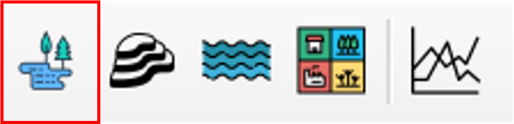

To run the add reservoirs functionality, provide the path to the .toml-file of the wflow model you want to add the reservoirs to, 
provide the vector layer with the reservoirs and a target folder for the model with the new reservoirs. 
Press ``Run`` to execute the functionality. See the figure below:

**The** ``Add reservoir`` **panel in the wflow NbS design tool**

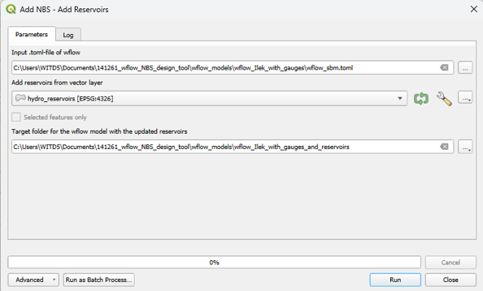

The plugin makes use of the python package HydroMT-wflow to add the reservoirs to the wflow model. 
The plugin will also return the logging of HydroMT-wflow in the Processing Log panel. See the figure below:

**Result of the** ``Add reservoir`` **functionality in the wflow NbS design tool**

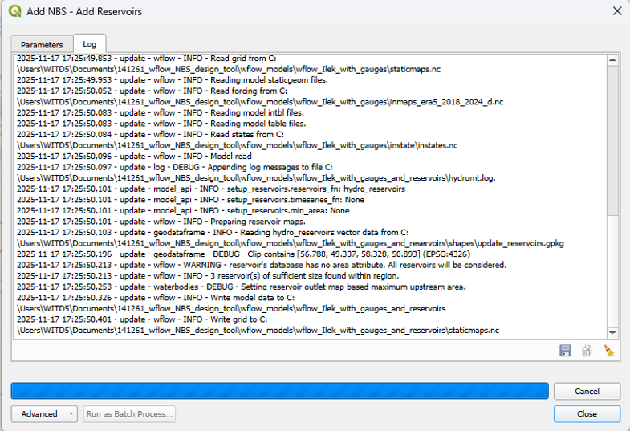

Change landuse
==============

The change landuse functionality changes the landuse of a wflow model. 
The change landuse functionality can be found in the wflow NbS design tool in the Processing Toolbox under ``Add NBS``.
The area in which the landuse needs to be changed should be prepared as a vector layer in QGIS. 
This vector layer should contain one ore more polygon(s) of the area in which the landuse needs to be changed, 
together with the new landuse class for that area. 
This landuse class should be provided as the landuse value in the orignal landuse map, in a separate field in the vector layer.
A template vector layer containing these fields can be generated using the ``Create landuse`` function.
This functionality can be found in the wflow toolbar, see the figure below:

**The** ``Create landuse`` **functionality in the wflow NbS design tool toolbar**

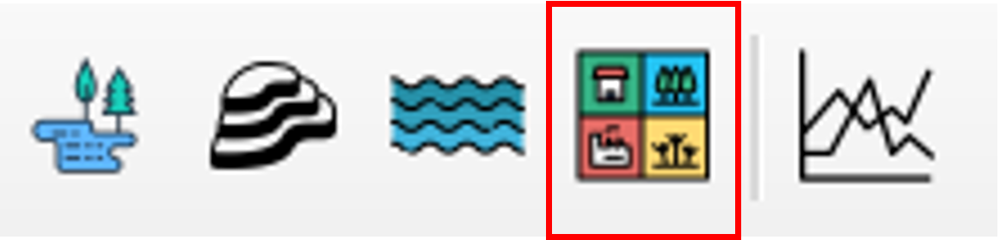

When this functionality is used, you also need to provide the landuse mapping that is used in the wflow model. 
This enables the plugin to let you choose a new landuse class directly from the set of landuse classes, instead of from their landuse values. 

To run the change landuse functionality, provide the path to the .toml-file of the wflow model you want to change the landuse of,
provide the landuse mapping that was used in the wflow model, 
provide the orignal landuse map from which the wflow model was derived, 
provide the vector layer with the polygon(s) in which the landuse needs to be changed, 
provide the field in this vector layer that contains the new landuse class for the area,
and a target folder for the model with the new landuse. 
Press ``Run`` to execute the functionality. See the figure below:

**The** ``Change landuse`` **panel in the wflow NbS design tool**

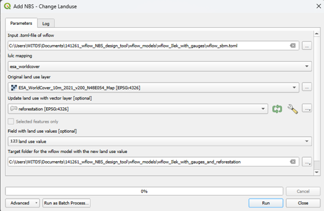

The plugin makes use of the python package HydroMT-wflow to update the landuse of the wflow model. 
The plugin will also return the logging of HydroMT-wflow in the Processing Log panel. See the figure below:

**Result of the** ``Change landuse`` **functionality in the wflow NbS design tool**

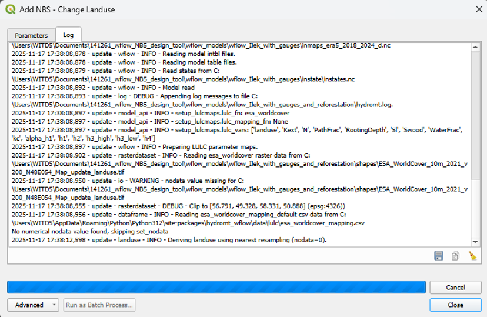

Add check dams
==============

The add check dams functionality adds check dams to a wflow model.
The add check dams functionality can be found in the wflow NbS design tool in the Processing Toolbox under ``Add NBS (experimental)``.  
This functionality is experimental because the check dams are not literally schematized in the wflow model, 
but their effect is simulated by increasing the Manning Roughness of the rivers cells in which the check dams are located.
The area in which the check dams need to be added should be prepared as a vector layer in QGIS.
This vector layer should contain one or more polygon(s) of the area in which the check dams need to be added. 
A template vector layer for this/these polygon(s) can be generated using the ``Create check dams`` function.
This functionality can be found in the wflow toolbar, see the figure below:

**The** ``Create check dams`` **functionality in the wflow NbS design tool toolbar**

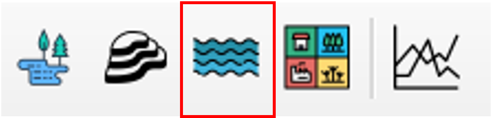

To run the add check dams functionality, provide the path to the .toml-file of the wflow model you want to add the check dams to,
provide the layer with the original Manning Roughness of the river cell (N_River),
provide the vector layer with the polygon(s) in which the check dams need to be added,
provide the multiplication factor to increase the Manning Roughness of the river cells in which the check dams are located (default = 1.5), 
and a target folder for the model with the new check dams. 
Press ``Run`` to execute the functionality. See the figure below:

**The** ``Add check dams`` **panel in the wflow NbS design tool**

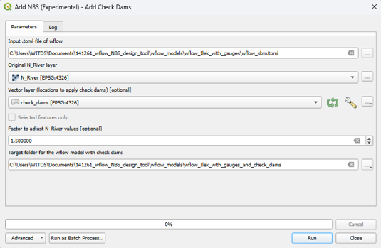

The plugin uses a python algorithm to multiply the Manning Roughness of the river cells in which the check dams are located.
The plugin will also return the logging of this algorithm in the Processing Log panel. See the figure below:

**Result of the** ``Add check dams`` **functionality in the wflow NbS design tool**

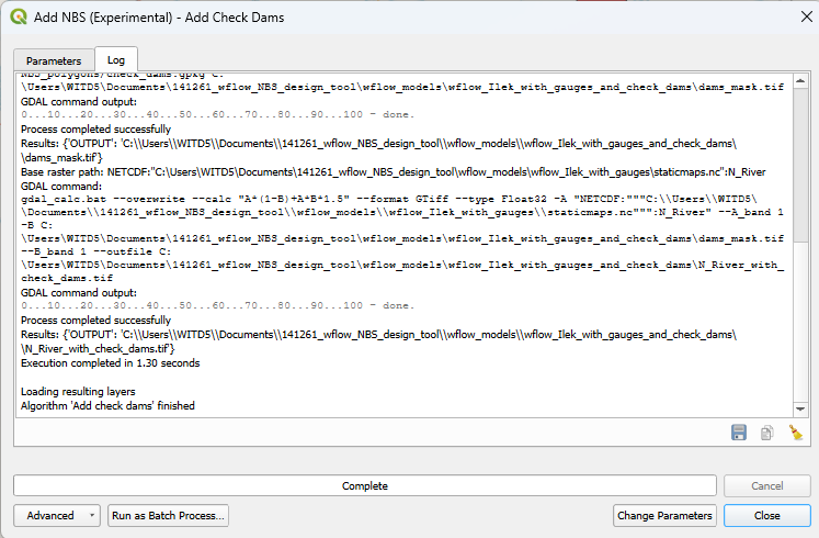

Add terracing
=============

The add terracing functionality adds terraces to a wflow model.
The add terracing functionality can be found in the wflow NbS design tool in the Processing Toolbox under ``Add NBS (experimental)``.
This functionality is experimental because the terracing is not literally schematized in the wflow model,
but its effect is simulated by decreasing the slope of the cells in which the terraces are located.
The area in which the terraces need to be added should be prepared as a vector layer in QGIS.
This vector layer should contain one or more polygon(s) of the area in which the terraces need to be added. 
A template vector layer for this/these polygon(s) can be generated using the ``Create terraces`` function.
This functionality can be found in the wflow toolbar, see the figure below:

**The** ``Create terraces`` **functionality in the wflow NbS design tool toolbar**

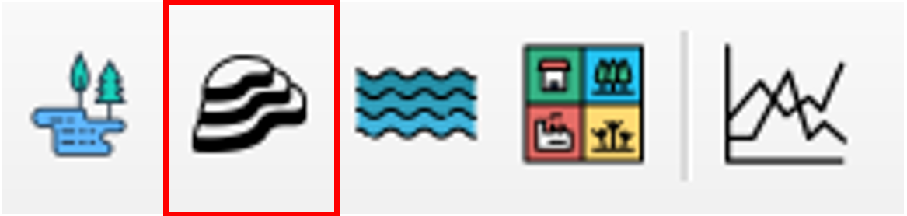

To run the add terracing functionality, provide the path to the .toml-file of the wflow model you want to add the terraces to,
provide the layer with the original slope of the cells (Slope), 
provide the vector layer with the polygon(s) in which the terraces need to be added,
provide the multiplication factor to decrease the slope of the cells in which the terraces are located (default = 0.5),
and a target folder for the model with the new terraces. 
Press ``Run`` to execute the functionality. See the figure below:

**The** ``Add terracing`` **panel in the wflow NbS design tool**

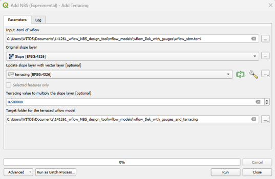

The plugin uses a python algorithm to multiply the slope of the cells in which the terraces are located.
The plugin will also return the logging of this algorithm in the Processing Log panel. See the figure below:

**Result of the** ``Add terracing`` **functionality in the wflow NbS design tool**

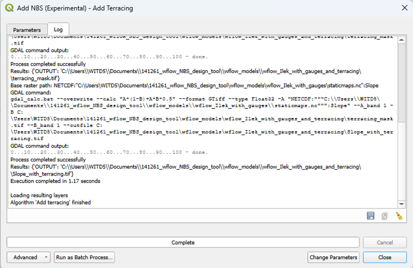

