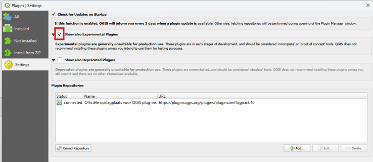
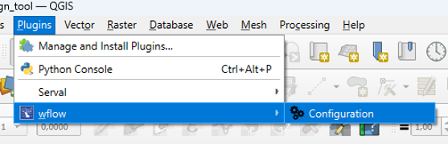
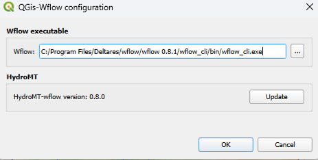

==============================
Installation and Configuration
==============================

.. note::
    This installation guide assumes you have a working installation of QGIS on your machine. If you don't have QGIS installed, please visit
    the `QGIS website <https://qgis.org/en/site/forusers/download.html>`_ to download and install the latest version of QGIS.

.. note::
    Python is in the heart of QGIS (or in the guts if you prefer), which enables us to use tons of third party Python libraries. In Linux systems,
    QGIS will use the main Python installation, but in Windows things get more complicated. QGIS has it’s own Python, which means we end up with 
    various Pythons on our machine.

    In order to use HydroMT-wflow from within QGIS, we need to install the wflow-plugin within the correct Python environment. This guide will
    help you to install the wflow-plugin in the correct Python environment. This manual is written for Windows users. 

Installation
------------

The wflow NbS design tool is available in the QGIS plugin repository as an experimental plugin. To install the plugin, follow the steps below:

- Open QGIS and navigate to the ``Plugins`` menu.
- Click on the ``Manage and Install Plugins`` option.
- Go to the ``Settings`` tab and check the box for ``Show also Experimental Plugins``.

**Check the box for** ``Show also Experimental Plugins``

- Go to the ``All`` tab and search for ``wflow NBS design tool``.
- Click on the ``Install Plugin`` button to install the plugin.

Configuration
-------------

After installing the plugin, you need to configure the plugin to set the correct path to your ``wflow`` installation and to install or update
hydromt-wflow and its dependencies. To do this, follow the steps below:

- Open QGIS and navigate to the ``Plugins`` menu.
- Click on the ``wflow`` sub-menu.
- Select the ``Configuration`` option.

**Find the configuration option in the** ``wflow`` **sub-menu**

In the configuration window, you can set the path to your ``wflow`` installation and install or update the ``hydromt-wflow`` package and its
dependencies by using the button. When ``hydromt-wflow`` is installed, its version will be displayed in the configuration window. The wflow-plugin 
is developed for wflow version 0.8.1 and HydroMT-wflow version 0.8.0.

**Configuration of the wflow-plugin for wflow 0.8.1 and HydroMT-wflow 0.8.0**

.. note::
    When ``hydromt-wflow`` is installed or updated, it is required to restart QGIS to make the changes effective. After the installation a 
    message will be displayed in the configuration window to remind you to restart QGIS.
