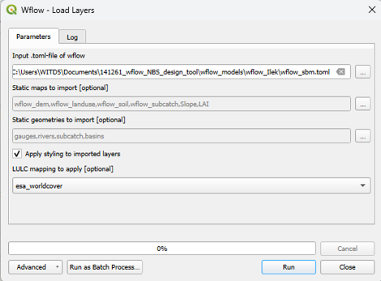
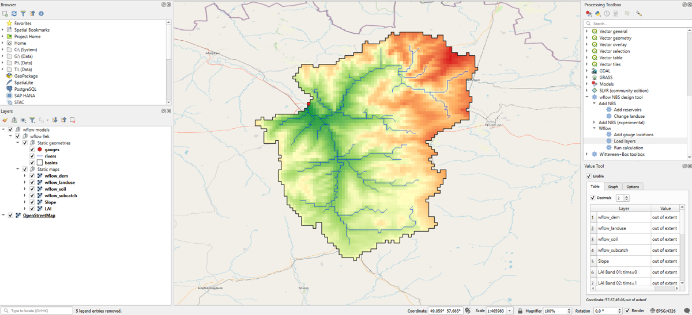
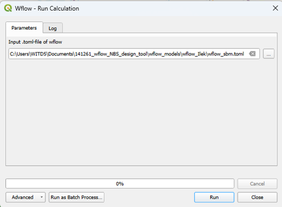
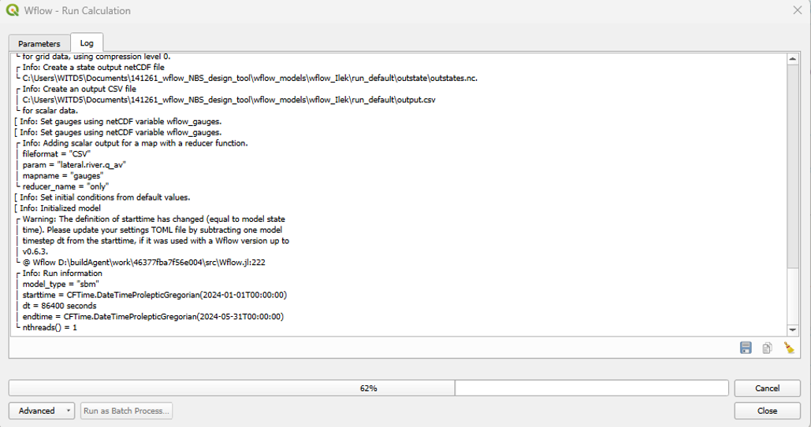
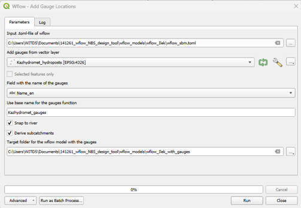
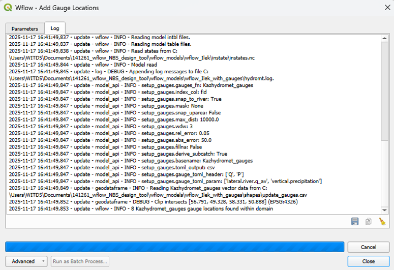
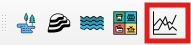
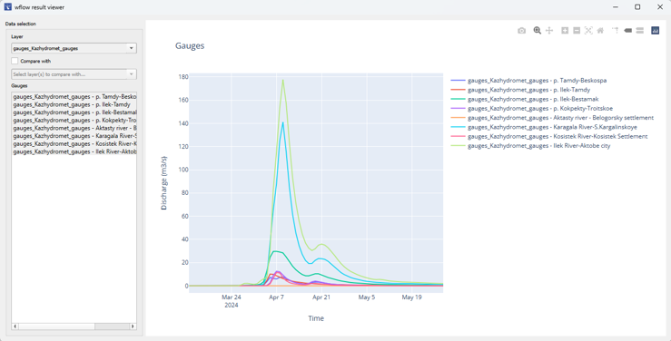

=====================
wflow functionalities
=====================

Load layers
===========

The load layers functionality loads some basic layers of a wflow model into QGIS. The load layers functionality can be found in the wflow NbS design tool
in the processing toolbox under ``Wflow``. To run the load layers functionality, provide the path to the .toml-file of the wflow model, choose the static 
maps you want to import and choose the static geometries you want to import. Also, the box ``Apply styling to imported layers`` can be checked. This will 
apply a default styling to the layers that are imported by default. You'll need to provide the landuse mapping that should be applied to the wflow_landuse map.
This can either be ``globcover``, ``esa_worldcover``, ``vito`` or ``corine``. See the figure below: 

**The** ``Load layers`` **panel in the wflow NbS design tool**

By default, the following static geometries are loaded: 

- gauges

- rivers

- subcatch

- basins

By default, the following static maps are loaded: 

- wflow_dem
  
- wflow_landuse
  
- wflow_soil
  
- wflow_subcatch
  
- Slope
  
- LAI

- N_River

It is advised to load the layers of a model in a separate group in the Layers panel. The static geometries and the static maps are loaded in separate groups. 
The results looks like is shown below: 

**Result of the** ``Load layers`` **functionality in the wflow NbS design tool**

Run calculation
===============

The run calculation functionality runs a wflow model from QGIS. The run calculation functionality can be found in the wflow NbS design tool in the Processing 
toolbox under ``Wflow``. To run the run calculation functionality, provide the path to the .toml-file of the wflow model and press ``Run``. See the figure below: 

**The** ``Run Calculation`` **panel in the wflow NbS design tool**

The plugin will return the wflow logging in the Processing Log panel. The Processing Log panel also shows the progress of the calculation. See the figure below: 

**Result of the** ``Run Calculation`` **functionality in the wflow NbS design tool**

Add gauge locations
===================

The add gauge locations functionality adds gauge locations to a wflow model. The add gauge locations functionality can be found in the wflow NbS design tool
in the Processing Toolbox under ``Wflow``. The gauge location(s) to be added to a wflow model need(s) to be prepared as a vector layer in QGIS. This vector layer
should contain the points of the gauge locations and a field with the names of the gauge locations. To run the add gauge locations functionality, provide
the path to the .toml-file of the wflow model you want to add the gauge locations to, provide the vector layer with the gauge locations and the name of the 
field with the names of the gauge locations in that vector layer. You can also use a base name for the gauge locations. This base name will be used together
with the prefix ``gauges_`` to name the new gauge locations. The checkboxes ``Snap to river`` and ``Derive subcatchments`` can be checked to snap the gauge locations
to river cells, and to derive the subcatchments of the new gauge locations. Lastly, a target folder for the model with the new gauge locations should be 
provided. Press ``Run`` to execute the functionality. See the figure below:

**The** ``Add Gauge Locations`` **panel in the wflow NbS design tool**

The plugin makes use of the python package HydroMT-wflow to add the gauge locations
to the wflow model. The plugin will also return the logging of HydroMT-wflow in the Processing Log panel. See the figure below:

**Result of the** ``Add Gauge Locations`` **functionality in the wflow NbS design tool**

Results viewer
==============

The results viewer functionality visualizes the results of a wflow model in QGIS. The results viewer functionality can be found in the wflow NbS design tool 
toolbar. See the figure below: 

**The** ``Results Viewer`` **functionality in the wflow NbS design tool toolbar.**

The Results viewer plots the timeseries of the discharges of a wflow model at the gauge locations of the model. 
The gauge locations are loaded from a wflow model based on the vector layer(s) that is/are provided in the results viewer panel. 
Once a vector layer with gauge locations is provided, the gauge locations are loaded from the wflow model and shown in a list under ``Gauges``. 
One or multiple gauges can be selected from the list. The discharge timeseries of the selected gauge(s) is/are plotted in a graph. 
You can zoom in and out of the graph, and pan through the graph. See the figure below:

**The** ``Results Viewer`` **panel in the wflow NbS design tool**

The results viewer can also be used to compare the discharges of two wflow models (with for instance different scenario's or NbS designs). 
To do this you need to check the box ``Compare with`` and provide two vector layers with gauge locations from the two wflow models. 
The gauge locations need to be the same in both wflow models. The result of both models is plotted in the same graph. 

.. note::
    Note that you need to run a wflow model first before you can visualize its results in the results viewer!

